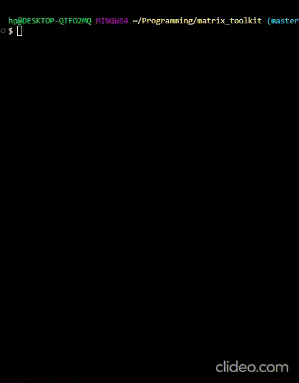

# Matrix Toolkit

Matrix Toolkit is a command-line interface (CLI) application that allows users to perform various operations on matrices. It uses a custom library crate in `src/lib.rs`



## Features

- Matrix Creation

  Users can create matrices in different ways, such as manually entering the elements, creating a zero matrix, identity matrix, scalar matrix, or diagonal matrix.

- Performing Matrix Operations

  Users can perform matrix operations like addition, subtraction, multiplication, scalar multiplication and find the trace, transpose, determinant, adjoint and inverse of a matrix.

- Checking Matrix Properties

  Users can check various properties of a matrix, such as whether it is square, symmetric, skew-symmetric, diagonal, scalar, identity, zero, or singular.

## Installation

To build and run this project, you need to have Rust and Cargo installed on your system. If you don't have them installed, you can get them from [rustup.rs](https://rustup.rs/).

Clone the repository and build the project:

```bash
git clone https://github.com/Hisham743/matrix_toolkit.git
cd matrix_toolkit
cargo build --release
```

## Usage

To use the command-line interface:

```bash
cargo run --bin cli
```

## Development

To run tests for the library:

```bash
cargo test
```
